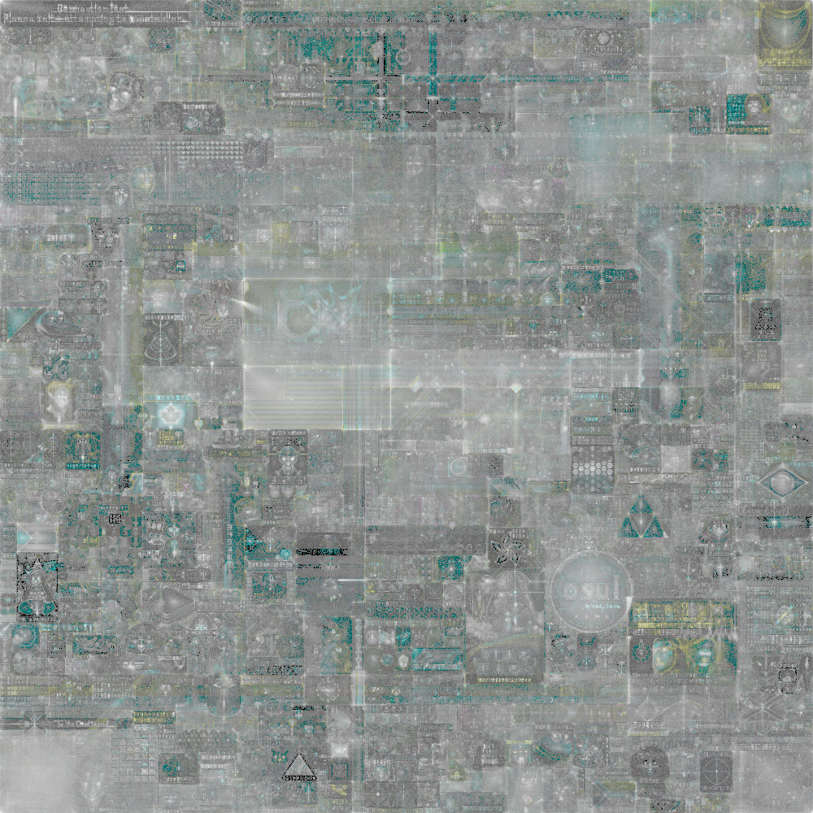

# Playing with place

A few scripts to generate visulizations of r/place2022

They all read input for imadges with names piped in:

    find /path/to/place/captures | python3 total.py

Thanks to #ProstoSanja for the data that made this possible

### Note on sizing

The scripts need 1000x1000 imadges, so you may want to run them multaple times and combine the output

## Scripts

- vid.py: generates an unaltered 1000x1000 video of r/place

- heat.py: generates a video heatmap

- total.py: generates a log scale heatmap.
